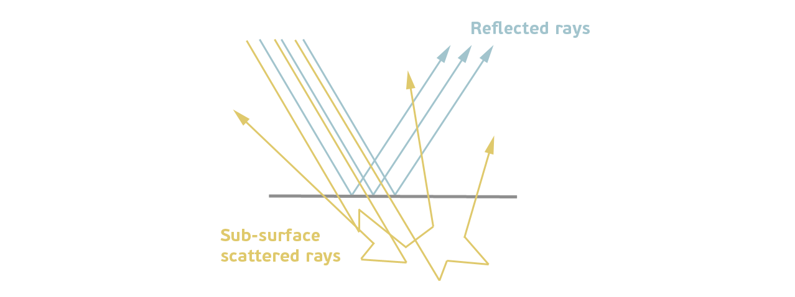
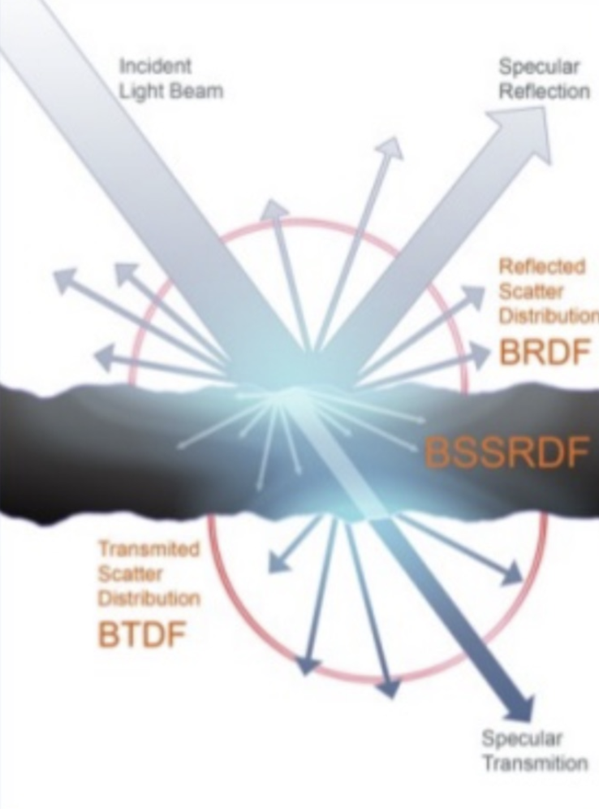
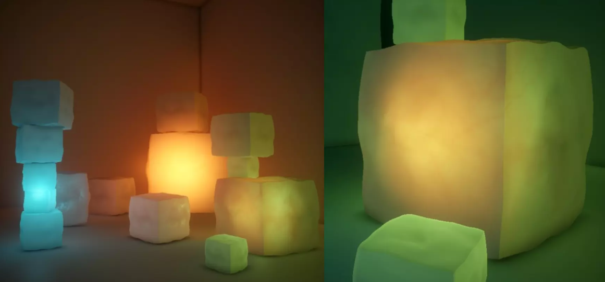
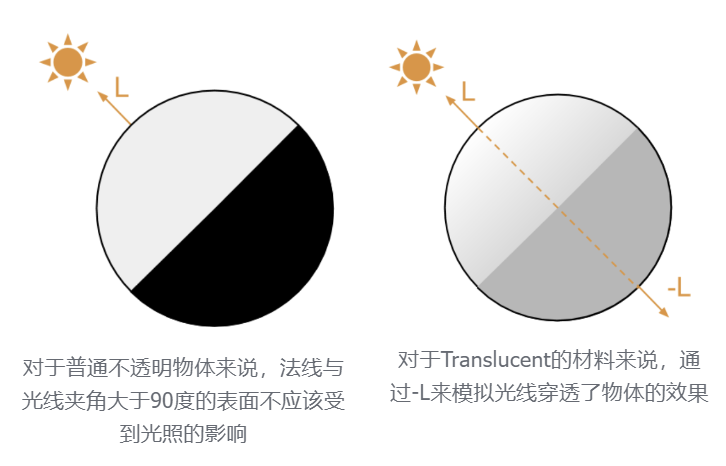
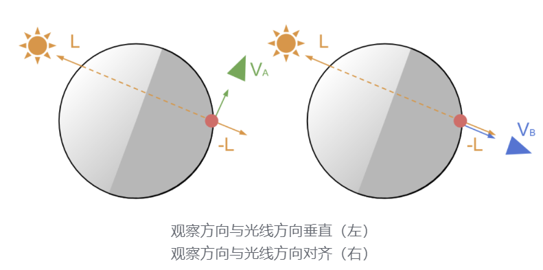
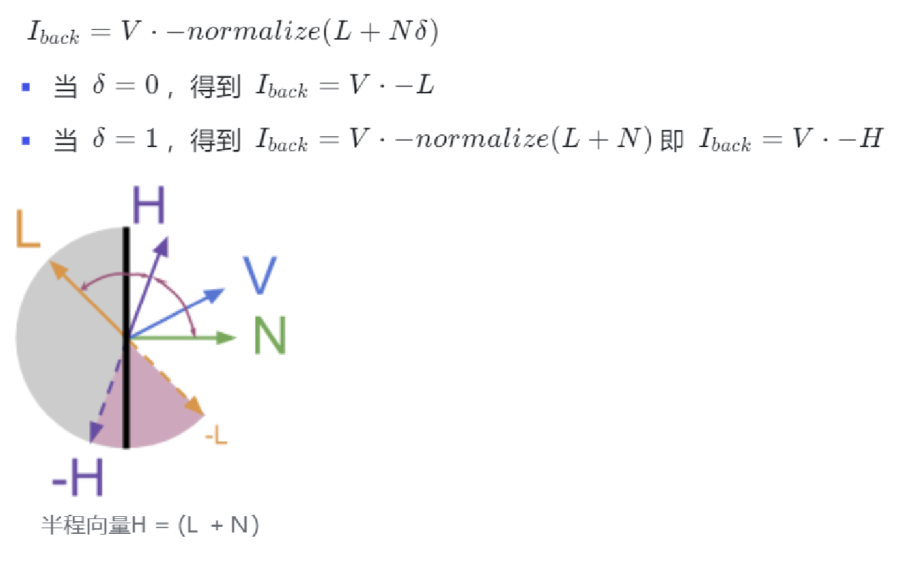
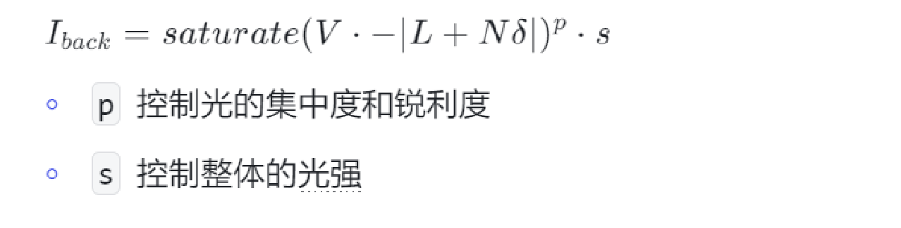
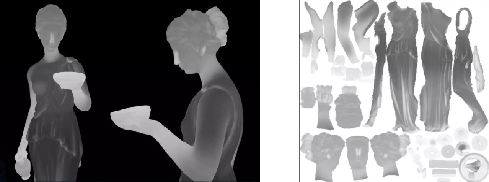

import LocalVideo from '../../components/LocalVideo.astro'

### 效果介绍

#### 3S材料

The quality of allowing light to pass partially and diffusely inside media.


#### 图形学中的3S模拟

> 📣 次表面散射（Subsurface Scattering， 简称 SSS）是指光线进入半透明材料的表面后，在材料内部发生多次散射和吸收，并最终重新从材料表面射出的现象。

**光线的入射**： 光线击中物体表面后，一部分会被直接反射，另一部分会*进入物体内部*。( BRDF)

**多次散射与吸收**： 光线进入材料后，会*与材料中的微粒或结构相互作用，发生多次散射和吸收*。 ( BSSRDF)

- 材料的吸收系数（Absorption Coefficient）决定了光线在传播过程中损失多少能量
- 散射系数（Scattering Coefficient）决定了光线的散射强度

**光线的重新射出**： 部分光线在经过多次散射后会回到物体表面，_并以新的方向射出_。( BTDF)



**光线的传播与和不同介质的交互模型**

| 属性         | _BRDF_   | _BTDF_   |
| ------------ | -------- | -------- |
| **定义**     | 表面反射 | 表面透射 |
| **光学现象** | 反射     | 透射     |



### 实现原理

#### 效果关键点

> 📣 虽然通过精准 BRDF + BSSRDF + BTDF 的数学模型来模拟 3S 的效果很好，但是性能消耗大



**厚度**

光线在物体内部传播，会受到*物体厚度*的影响

- 在较厚的地方，光线在内部的路径更长，能量会因为散射和吸收而逐渐衰减
- 物体厚度影响散射后透出的光的颜色（因为光的吸收量不同）

**视角与光线入射角度的影响**

- 需要有 _view-dependent 以及 light-dependent_ 的漫反射与光衰减 （要与观察方向以及光线方向有关）

---

#### 模拟方法

**~~背光模拟~~**

**原理**



- 对于 translucent 材料来说，一盏灯光需要计算两种效果的实现: 正面照明（左）& 背面照明（右）

> 📣 **为什么用 -L 来模拟散射后的出射光是合理的近似？**
>
> 尽管散射会随机改变光线的方向，但对于大多数半透明材料来说散射光线在经过多次散射后，整体方向会偏向光源的原始方向。这种现象被称为前向**散射**，是许多材料（特别是有机材料）的一种常见性质。



- 表面（红点）处于物体的背光处，应该受到-L光源的影响
- 当观测方向与光线方向对齐（右）时，应该能够看到背光的最大效果。当观测方向与光线方向垂直时，背光效果应该最小

**公式**

```javascript
V\cdot(-L)
```

- 当观察方向与-对齐时，即观察者与光源位于物体两侧时，散射光应该是最容易到达观察者的情况，这个情况下点积结果是 1
- 这种方法可以直接衡量观察者和光源方向是否对称，非常适合用于背光模拟

---

**~~法线扰动~~**

**原理**

- 除了考虑视线方向与光源方向对背光效果的影响，物体表面的朝向，即物体的法线也应该对光线穿透物体后射出的角度有所影响
- Subsurface distortion $$\delta $$
- 参数 $$\delta$$的作用是使-L向表面法线 N 方向偏移，控制表面法线对出射光线的偏移强度

**公式**



---

**~~光效控制~~**

**公式**



---

**~~厚度模拟~~**

**原理**

- 背光的强度应该受到物体厚度的影响，理想情况下应该继续要知道光线Markdown Preview Enhanced在物体内部传播的路径距离，并将这个距离纳入到光照衰减的考虑中
- 通过一张贴图来记录“物体厚度”，并通过厚度来表示光在物体内部传播路径的距离长短 - _Local Thickness Map_
- 真实的光在物体内部的路径长度与光源的入射方向有关，所以这个“物体的厚度”其实取决于光线的入射角度。所以通过Thickness map来模拟厚度并不真实准确，但能够一定程度上给出正确的视觉效果

**Local Thickness Map**

- 通过翻转法线计算物体 AO （Normal-inverted computation of ambient occlusion）来模拟厚度，并烘焙这个特殊的 AO 贴图
  - 翻转物体表面法线
  - 渲染 AO
  - 翻转 AO 贴图颜色并存储
- 这个 AO 贴图甚至可以不局限于灰度图，可以用于光线从透射穿过物体后发散出来的颜色

> 📣 **翻转法线烘焙的 AO 贴图**
>
> AO 贴图用于表示环境中有多少光能够到达表面上的某一点翻转法线后烘焙的 AO 贴图可以用于表示物体内部的光线传播情况



### 具体实现

#### 3S效果公式

> 📣 **3S = 背光 + 法线扰动 + 光效控制 + 厚度模拟**

---

#### URP管线下的基础实现

**背光**

```c
  half4 frag(Varyings i) : SV_Target
  {
      half4 color;
      Light mainLight = GetMainLight();
      half3 N = normalize(i.normalWS);
      half3 L = mainLight.direction;
      half3 V = normalize(_WorldSpaceCameraPos - i.positionWS);
      half3 H = normalize(V + L);

      // 背面光照 -----------------------------
      // dot(V, -L)
      half3 backLight = saturate(dot(V, -L));
      return float4(backLight,1);
  }
```

<LocalVideo src='/assets/Effects/3S/video1.mp4' alt='video1' />-
当视角与光线垂直时，看不见背光效果。当视角与光线对齐时，背光效果最强

---

**法线扰动**

```c
half4 frag(Varyings i) : SV_Target
{
    ...

    // 背面光照 -----------------------------
    half3 halfNL = normalize(L + N * _Distortion);
    // dot(V, -H)
    half3 backLight = saturate(dot(V, -halfNL)); // dot(V, -|L + N * delta|)
    return float4(backLight,1);
}
```

Normal Distortion = 0时，即无法线扰动，网格受到背光影响但是法线对出射光的方向无干扰，物体缺少细节

$$ V\cdot(-L) $$ ss

### 相关资源
