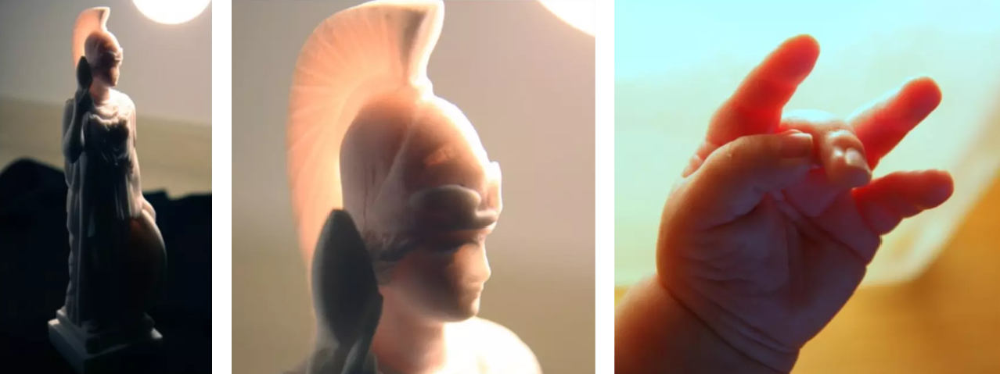

### 效果介绍

#### 3S材料

The quality of allowing light to pass partially and diffusely inside media.

---

#### 图形学中的3S模拟

> 次表面散射（Subsurface Scattering， 简称 SSS）是指光线进入半透明材料的表面后，在材料内部发生多次散射和吸收，并最终重新从材料表面射出的现象。

**光线的入射**： 光线击中物体表面后，一部分会被直接反射，另一部分会*进入物体内部*。( BRDF)

**多次散射与吸收**： 光线进入材料后，会*与材料中的微粒或结构相互作用，发生多次散射和吸收*。 ( BSSRDF)

- 材料的吸收系数（Absorption Coefficient）决定了光线在传播过程中损失多少能量
- 散射系数（Scattering Coefficient）决定了光线的散射强度

**光线的重新射出**： 部分光线在经过多次散射后会回到物体表面，_并以新的方向射出_。( BTDF)

**光线的传播与和不同介质的交互模型**

| 属性         | _BRDF_   | _BTDF_   |
| ------------ | -------- | -------- |
| **定义**     | 表面反射 | 表面透射 |
| **光学现象** | 反射     | 透射     |

### 实现原理

#### 效果关键点

> 虽然通过精准 BRDF + BSSRDF + BTDF 的数学模型来模拟 3S 的效果很好，但是性能消耗大

**厚度**

光线在物体内部传播，会受到*物体厚度*的影响

- 在较厚的地方，光线在内部的路径更长，能量会因为散射和吸收而逐渐衰减
- 物体厚度影响散射后透出的光的颜色（因为光的吸收量不同）

**视角与光线入射角度的影响**

- 需要有 _view-dependent 以及 light-dependent_ 的漫反射与光衰减 （要与观察方向以及光线方向有关）

---

#### 模拟方法

**背光模拟**

原理

- 对于 translucent 材料来说，一盏灯光需要计算两种效果的实现: 正面照明（左）& 背面照明（右）

> **为什么用 -L 来模拟散射后的出射光是合理的近似？尽管散射会随机改变光线的方向，但对于大多数半透明材料来说散射光线在经过多次散射后，整体方向会偏向光源的原始方向。这种现象被称为前向散射**，是许多材料（特别是有机材料）的一种常见性质。

- 表面（红点）处于物体的背光处，应该受到-L光源的影响
- 当观测方向与光线方向对齐（右）时，应该能够看到背光的最大效果。当观测方向与光线方向垂直时，背光效果应该最小

---

公式

$V\cdot(-L)$

### 具体实现

### 相关资源
